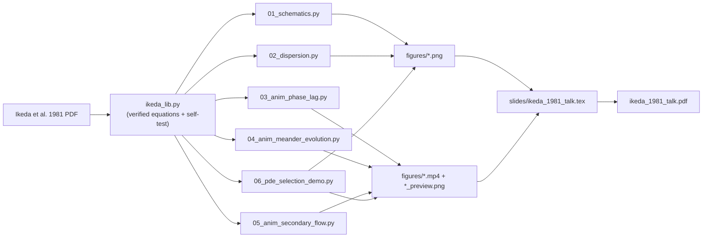

# Ikeda, Parker & Sawai (1981) — Bend Theory of River Meanders, Part 1

A visual explainer of the linear meander-instability theory in

> Ikeda, S., Parker, G. & Sawai, K. (1981) **"Bend theory of river meanders. Part 1. Linear development."** *J. Fluid Mech.* **112**, 363–377.

The package reproduces the paper's physics as **static figures**, **mp4 animations**, and a **Beamer/PDF slide deck**. Every quantitative result is computed from the *verified* linear relations in [`ikeda_lib.py`](ikeda_lib.py) (re-derived from the PDF, with self-tests that reproduce the paper's headline numbers).

## The physics in one paragraph

A sinuous channel with erodible banks is **linearly unstable**: straight channels spontaneously meander. Curvature drives a secondary (helical) circulation — closed via `η'/H = −A·C'·n`, with `A ≈ 2.89` for alluvial rivers — which shifts the high-velocity core toward the outer bank. Because the near-bank velocity responds to curvature through a *damped, first-order* operator, it **peaks ≈ 0.18 wavelength downstream** of each bend apex. Bank erosion follows that near-bank velocity, so the outer bank just past the apex erodes fastest, which makes each bend simultaneously **grow** (amplitude ∝ e^{αt}) and **migrate downstream** (celerity c = ω/k). The resulting dispersion relation

```
α₀(k) = [2 Cf²(A+F²) k² − k⁴] / (k² + 4 Cf²)          (growth rate)
ω₀(k) =  Cf k³ (2+A+F²)      / (k² + 4 Cf²)            (migration frequency)
```

has a most-unstable wavenumber `k_OM = β Cf` with `β² = 4√(1+½(A+F²)) − 4`. For the alluvial case this gives `k_OM ≈ 1.50 Cf` — a meander wavelength that matches field/lab data over five decades **with no fitted constant**.

## Files

| File | What it does |
|------|--------------|
| [`ikeda_lib.py`](ikeda_lib.py) | Shared core: verified dispersion relations, near-bank velocity / phase lag, centreline generator, plot style, mp4 helper. Run it directly for the self-test. |
| [`01_schematics.py`](01_schematics.py) | `fig01`–`fig05`: definition sketches, secondary flow, bank-erosion geometry, and the phase-lag "money figure". |
| [`02_dispersion.py`](02_dispersion.py) | `fig06`–`fig10`: growth rate, celerity, combined dispersion, wavelength scaling, and a parameter-sensitivity map. |
| [`03_anim_phase_lag.py`](03_anim_phase_lag.py) | mp4: the curvature–velocity phase lag that drives downstream migration. |
| [`04_anim_meander_evolution.py`](04_anim_meander_evolution.py) | mp4: growth + migration + wavelength selection from a multi-mode seed. |
| [`05_anim_secondary_flow.py`](05_anim_secondary_flow.py) | mp4: helical secondary flow in a bend cross-section (parameter `A`), reversing through each inflection. |
| [`06_pde_selection_demo.py`](06_pde_selection_demo.py) | `fig11`–`fig13` + mp4: Eq. (16) **integrated numerically** (pseudo-spectral RK4) — a localized bump grows into a downstream-spreading `k_OM` wavetrain; spectrum checked mode-by-mode against the closed-form normal modes. |
| [`slides/ikeda_1981_talk.tex`](slides/ikeda_1981_talk.tex) | Beamer source (23 slides). |
| `slides/ikeda_1981_talk.pdf` | Compiled deck. |
| `figures/` | All `.png` figures, the three `.mp4` animations, and per-animation preview stills. |
| `data/` | (reserved for cached theory arrays) |

## Parameters (paper's canonical values)

| Symbol | Meaning | Value used |
|--------|---------|-----------|
| `Cf` | friction coefficient | 0.01 (typical 0.005–0.03) |
| `A`  | secondary-flow / transverse-bed-slope parameter | 2.89 (alluvial); 0 (incised) |
| `F`  | Froude number `U₀/√(gH₀)` | 0.30 (subcritical) |
| `k`  | dimensionless wavenumber `2πH₀/λ` | — |
| `β`  | `k_OM/Cf` | 1.50 (alluvial) |

## Workflow



## Run

All Python uses the `fourcastnetv2` micromamba environment (numpy, scipy, matplotlib, imageio-ffmpeg).

```bash
cd /net/flood/data2/users/x_yan/rossby_palooza/numerical/ikeda_1981

# 0. sanity-check the equations (reproduces the paper's k_OM, α_OM, c_OM)
micromamba run -n fourcastnetv2 python ikeda_lib.py

# 1. static figures  -> figures/fig01..fig10.png
micromamba run -n fourcastnetv2 python 01_schematics.py
micromamba run -n fourcastnetv2 python 02_dispersion.py

# 2. animations  -> figures/*.mp4 (+ previews).  Use --max-frames 1 for a quick test.
micromamba run -n fourcastnetv2 python 03_anim_phase_lag.py
micromamba run -n fourcastnetv2 python 04_anim_meander_evolution.py
micromamba run -n fourcastnetv2 python 05_anim_secondary_flow.py

# 2b. numerical PDE demo  -> figures/fig11..fig13.png + pde_selection.mp4
micromamba run -n fourcastnetv2 python 06_pde_selection_demo.py

# 3. slide deck  -> slides/ikeda_1981_talk.pdf
cd slides && lualatex ikeda_1981_talk.tex && lualatex ikeda_1981_talk.tex
```

## Deliverables at a glance

**Figures** (`figures/`): `fig01` planform definition · `fig02` cross-section · `fig03` secondary flow · `fig04` bank-erosion geometry · `fig05` phase-lag mechanism · `fig06` growth rate · `fig07` celerity · `fig08` combined dispersion · `fig09` wavelength scaling · `fig10` sensitivity map · `fig11` PDE waterfall (localized bump → `k_OM` train) · `fig12` PDE spectrum vs normal-mode prediction · `fig13` RK4 4th-order convergence.

**Animations** (`figures/`): `phase_lag.mp4` · `meander_evolution.mp4` · `secondary_flow.mp4` · `pde_selection.mp4` (each with a `_preview.png`).

**Slides**: `slides/ikeda_1981_talk.pdf` — 23 slides, intuition → full derivation → dispersion relation → results → validation → Part 2 outlook. The three animation slides show a preview still with a caption pointing to the `.mp4` (play it separately when presenting; mp4s do not embed reliably in PDF viewers).

## Provenance

This is the canonical copy under `numerical/` (one subfolder per literature paper). It was
snapshot-copied byte-identically from the original build at `rossby_palooza/ikeda_1981/`
(completed 2026-07-06 15:13) on 2026-07-06 15:32, then **extended** with the numerical PDE
block (`ikeda_lib.py` Eq.-16 section + `06_pde_selection_demo.py`, `fig11`–`fig13`,
`pde_selection.mp4`, and the corresponding `_pde_self_test` assertions). The root copy is
retained unmodified for reference and may be deleted at the owner's discretion.

## A note on the "validation" figures

The paper validates its wavelength prediction against 158 laboratory + 73 natural alluvial reaches (its Figs. 4–5). Rather than fabricate that scatter, this package plots the **exact theoretical prediction curves and scaling laws** (`fig09`) and describes the paper's data comparison qualitatively — the theory has a definite, constant-free scaling to test against.
